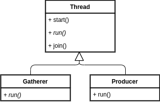
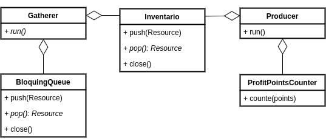

# TP 2 - Recolcetores y productores | Taller 7542

## Trabajo práctico 2 - Simulación de recolectores y productores usando Threads 

### Taller de programación 75.42 - FIUBA

- Alumno: Agustín Emanuel More
- Padrón: 102914
- Repositorio github: https://github.com/moreover22/tp2-taller

Contenidos
---
- [Introducción](#Introducción)
- [Recolectores y productores](#Recolectores-y-productores)
- [Archivos](#Archivos)
- [Acceso a recursos compartidos](#Acceso-a-recursos-compartidos)
- [Variables condicionales](#Variables-condicionales)
- [Salida](#Salida)


Introducción
---

El trabajo consiste en el desarrollo de un programa de simulación de un sistema de productores y recolectores, con la salvedad, que se trata de una ejecución en tiempo real, es decir, todos los actores estarán actuando a a la vez (salvo limitaciones de hardware, es a lo que se apunta). Esto último se logragará mediante la programación concurrente utilizando `threads` en C++.

Recolectores y productores
---

El sistema cuenta con dos tipos de actores: los _Recolectores_ (`Gatherer`) y los _Productores_ (`Producer`). Donde los primeros serán los encargados de recolectar de un mapa algún tipo de material (_Madera_, _Trigo_, _Hierro_ o _Carbón_), estos recursos serán daspachados mediante una cola bloqueante (`BloquingQueue`) y depositarán lo recolectado en un inventario (`Inventory`) compartido. A su vez, los productores, tomarán los recursos del inventario y los transformarán en puntos de beneficio que serán depositados en un contador (`ProfitPointsCounter`), donde este también es compartido.

El modelo, toma en consiración que tanto los recolectores como los productores, deberán trabajar concurrentemente, es decir, un trabajador no debe esperar a que termine otro trabajador para realizar su tarea (salvo que este último esté usando algún recurso compartido). Para lograr esto, se utilizan hilos (`Thread`) de la siguente forma:

<p align="center">
    
</p>

E interactuarán con los recursas compartidos:
<p align="center">
    
</p>

Para tener en consideración en los siguientes puntos, se puede observar que tanto los productores como recolectores (más de uno, eventualmente), estarán accediendo al inventario. Además, el orden de ejeción establecerá que el inventario comienza vacio, con lo cual, los productores, deberán esperar a que el inventario contenga algún recurso antes de poder trabajar.

Archivos
---

La configuración de cantidad de trabajadores (actores), y la disposición del mapa, son obtenidas desde dos archivos. El primero, el de los trabajadores, con el siguiente formato:

```
<tipo de trabajador>=<cantidad>
```

Y el del mapa será una matriz, donde en cada posición se representa el recurso, mediante la inicial del mismo, que contiene el mapa en esa posición, por ejemplo:

```
MMHHMMHCCC
HHHMMMTTTM
```

Donde: `M` es para madera, `H` es para hierro, `C` es para carbón y `T` es para trigo.

Al ejecutar el programa, se pasará por parámetros la ruta para cada uno de estos archivos:

```
./tp <path a conf de trabajadores> <path archivo de mapa>
```

Cada archivo, tendrá una entidad asociada, encargada de parsear la información. Para el archivo de mapa, se cuenta con `MapParser` y para el de trabajadores está `WorkerParser`.

El `MapParser` adicionalmente, a medida que recorre el mapa, irá encolando los recursos en las respectivas colas bloqueantes. 

Para simplificar el uso de múltiples colas, trabajadores y accesos a inventario, se implementan dos clases contenedoras `GathererHandler` y `ProducerHandler`. Esto permite encapsular el uso de recursos asociados a cada trabajador.

Acceso a recursos compartidos
---

Tal como se expone en la [sección](#Recolectores-y-productores) de introducción a recolectores y productores, durante la ejecución del programa, habrá accesos a recursos compartidos por diferentes hilos. Esto es, cada `Gatherer` y cada `Producer` (que son hilos), estarán accediendo a los recursos de inventorio, colas bloqueantes y al contador de puntos de beneficio. Esto puede traer inconvenientes cuando un hilo utiliza un recurso y lo modifica y a su vez otro hilo hace lo mismo, por ejemplo:

(Lo siguiente es pseudo código y es caracter meramente ilustrativo)

```
def pop(cola):
    if not cola.esta_vacia():
        cola.pop()
```

- La cola tiene 1 elemento.
```
unHilo::cola.esta_vacia() 
```
- Se obtiene false, es decir, un podría hacer un pop.

- Otro hilo toma el control.
```
otreoHilo::cola.pop() 
```

- No hay problema, se vacía la cola.

- Vuelve el primer hilo.

```
otreoHilo::cola.pop() 
```
- No se puede hacer pop porque la cola está vacía.

Por esta razón es que se definen zonas mutamente excluyentes, es decir una porción de código donde no es razonable que dos hilos se ejecuten a la vez. C++ ofrece el mecanismo de `std::mutex` para conseguir esto.

Concretamente, en el trabajo, se definen estás zonas tanto cuando se hace un `push` o `pop` en las colas bloqueantes `BlockingQueue` o en el inventario `Inventory`. Además, como el `ProfitPointsCounter` es compartido por todos los hilos de `Producer`, el método `count` también se encuentra protegido por el correspondiente `mutex`.

Variables condicionales
---

Los recolectores (`Gatherer`) tienen que esperar a que todo el mapa sea parseado y cargado en la cola bloqueante. Para que el hilo se quede esperando se utiliza las `std::condition_variable` que provee C++ en su librería estándar, y una vez que se cumple la condición (esto es, se puede hacer `pop` de la cola, es decir, la cola no está vacía; o bien, se terminó de parsear el mapa y la cola está vacía) la espera cese y el recolector empiece a trabajar sobre el recurso que eventualmente logre recolectar.

En el caso de los productores (`Producer`), estos deben esperar que:

- Se puedan extraer recursos del inventario (esto es, que el mismo no esté vacío).
- Esos recursos sean los que el productor necesita.

Eventualmente, si el inventario se cierra (esto es, los recolectores no tiene más materia para recolectar) y los productores no tienen los recursos necesarios en el inventario para producir, los productores finalizarán de trabajar.

Salida
---

Una vez que todos los trabajadores hayan dejado de trabajar (ejecutado el método `run`), se procede a mostrar por `stdout` los resultados obtenidos, esto es:
- El estado final del inventario con los recursos restantes.
```
Recursos restantes:
  - Trigo: <cantidad de trigo restante>
  - Madera: <cantidad de madera restante>
  - Carbon: <cantidad de carbon restante>
  - Hierro: <cantidad de hierro restante>
```
__Observación__: En este caso (por enunciado), se debe respetar el orden, con lo cual, para almacenar esta información se optó por usar un `std::map` frente a un `std::unorder_map`, donde el primero introduce una noción de orden, mientras que el segundo no lo tiene.

- Los puntos de beneficio acumulados.
```
Puntos de Beneficio acumulados: <puntos acumulados>
```

Tanto el primer mensaje como el segundo, son producidos por las entidades que contienen dicha información (`Inventory`, `ProfitPointerCounter` en este caso). Esto permite respetar el encapsulamiento de datos.

<!-- 

Consideraciones de cv and mutex

Conclusion
 -->

